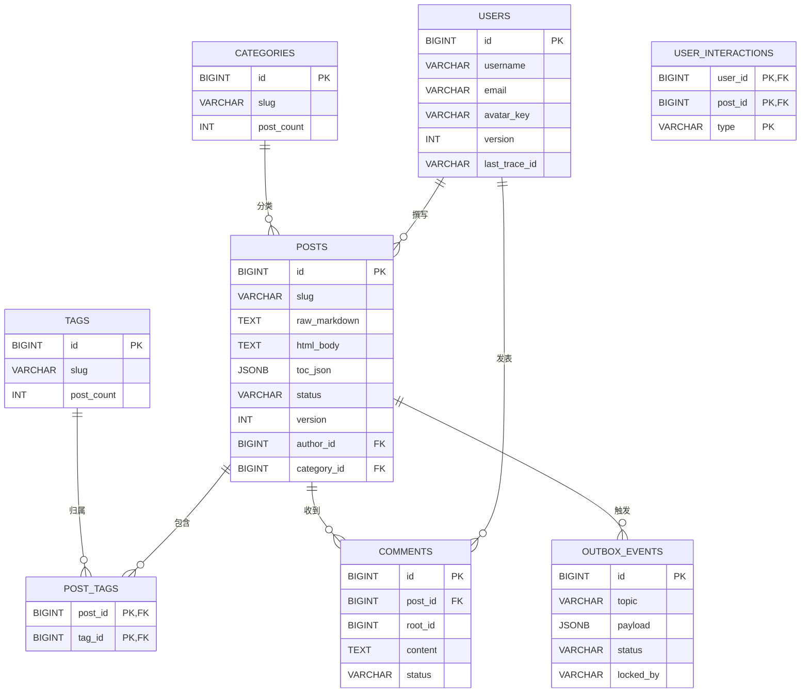

# Bifrost CMS 数据库架构 

## 核心元数据
*   **版本**：v3.2 (Go+Rust 微服务重构版)
*   **引擎**：PostgreSQL 16+ (Alpine)
*   **设计哲学**：哑数据库，强应用，运维优先

## 架构概述
本架构专为 Go 与 Rust 微服务集群设计，采用清晰的 Snowflake ID 主键策略和发件箱模式处理分布式事务，摒弃了数据库触发器和存储过程。

## ER 核心关系图

## 详细表结构说明

### users 表 (用户身份核心)
| 字段 | 类型 | 约束 | 说明 |
|------|------|------|------|
| id | BIGINT | PRIMARY KEY | Snowflake 算法生成的分布式唯一标识 |
| username | VARCHAR(32) | NOT NULL, 长度≥3 | 唯一用户名，用于登录和显示 |
| email | VARCHAR(255) | NOT NULL, 邮箱格式校验 | 用户邮箱地址，用于通知和找回密码 |
| password_hash | VARCHAR(255) | 条件约束 | Bcrypt 加密的密码哈希，OAuth用户可为空 |
| nickname | VARCHAR(64) | NULLABLE | 显示名称，默认为username |
| bio | TEXT | NULLABLE | 个人简介，支持Markdown格式 |
| avatar_key | VARCHAR(255) | NULLABLE | MinIO对象存储键，如`avatars/u123/me.jpg` |
| is_admin | BOOLEAN | NOT NULL DEFAULT FALSE | 管理员权限标志 |
| is_active | BOOLEAN | NOT NULL DEFAULT TRUE | 账户激活状态 |
| provider | auth_provider | NOT NULL DEFAULT 'local' | 认证提供商：local/github/google |
| provider_id | VARCHAR(255) | 条件约束 | OAuth提供商返回的用户标识 |
| version | INTEGER | NOT NULL DEFAULT 1 | 乐观锁版本号，防并发更新覆盖 |
| last_trace_id | VARCHAR(64) | NULLABLE | 最后操作链路追踪ID |
| meta | JSONB | DEFAULT '{}' | 扩展字段：主题偏好、UI配置等 |
| last_login_at | TIMESTAMPTZ | NULLABLE | 最后登录时间 |
| created_at | TIMESTAMPTZ | NOT NULL DEFAULT NOW() | 记录创建时间 |
| updated_at | TIMESTAMPTZ | NOT NULL DEFAULT NOW() | 最后更新时间 |
| deleted_at | TIMESTAMPTZ | NULLABLE | 软删除时间戳 |

### categories 表 (内容分类)
| 字段 | 类型 | 约束 | 说明 |
|------|------|------|------|
| id | BIGINT | PRIMARY KEY | Snowflake分布式唯一标识 |
| name | VARCHAR(64) | NOT NULL, UNIQUE | 分类显示名称 |
| slug | VARCHAR(64) | NOT NULL, UNIQUE | URL友好标识符 |
| description | TEXT | NULLABLE | 分类描述文本 |
| post_count | INTEGER | NOT NULL DEFAULT 0 | 文章数量统计（异步维护） |
| version | INTEGER | NOT NULL DEFAULT 1 | 乐观锁版本号 |
| meta | JSONB | DEFAULT '{}' | 扩展字段：图标、颜色、模板配置 |
| created_at | TIMESTAMPTZ | NOT NULL DEFAULT NOW() | 记录创建时间 |
| updated_at | TIMESTAMPTZ | NOT NULL DEFAULT NOW() | 最后更新时间 |

### tags 表 (内容标签)
| 字段 | 类型 | 约束 | 说明 |
|------|------|------|------|
| id | BIGINT | PRIMARY KEY | Snowflake分布式唯一标识 |
| name | VARCHAR(64) | NOT NULL, UNIQUE | 标签显示名称 |
| slug | VARCHAR(64) | NOT NULL, UNIQUE | URL友好标识符 |
| post_count | INTEGER | NOT NULL DEFAULT 0 | 文章数量统计（异步维护） |
| version | INTEGER | NOT NULL DEFAULT 1 | 乐观锁版本号 |
| meta | JSONB | DEFAULT '{}' | 扩展字段：图标、颜色等 |
| created_at | TIMESTAMPTZ | NOT NULL DEFAULT NOW() | 记录创建时间 |
| updated_at | TIMESTAMPTZ | NOT NULL DEFAULT NOW() | 最后更新时间 |

### posts 表 (文章核心)
| 字段 | 类型 | 约束 | 说明 |
|------|------|------|------|
| id | BIGINT | PRIMARY KEY | Snowflake分布式唯一标识 |
| title | VARCHAR(255) | NOT NULL | 文章标题 |
| slug | VARCHAR(255) | NOT NULL, UNIQUE | URL友好标识符 |
| summary | VARCHAR(500) | NULLABLE | 文章摘要（AI生成或手动填写） |
| resource_key | VARCHAR(255) | NULLABLE | MinIO资源文件夹路径 |
| cover_image_key | VARCHAR(255) | NULLABLE | 封面图存储路径 |
| raw_markdown | TEXT | NOT NULL | 原始Markdown内容（写模型） |
| html_body | TEXT | NULLABLE | 预渲染HTML内容（读模型） |
| toc_json | JSONB | NULLABLE | 目录结构JSON数据 |
| status | VARCHAR(20) | NOT NULL DEFAULT 'draft' | 状态：draft/published/archived |
| visibility | VARCHAR(20) | NOT NULL DEFAULT 'public' | 可见性：public/hidden/password |
| author_id | BIGINT | NOT NULL, FOREIGN KEY | 作者用户ID |
| category_id | BIGINT | NULLABLE, FOREIGN KEY | 分类ID |
| view_count | INTEGER | NOT NULL DEFAULT 0 | 浏览量统计 |
| like_count | INTEGER | NOT NULL DEFAULT 0 | 点赞量统计 |
| comment_count | INTEGER | NOT NULL DEFAULT 0 | 评论量统计 |
| version | INTEGER | NOT NULL DEFAULT 1 | 乐观锁版本号 |
| last_trace_id | VARCHAR(64) | NULLABLE | 最后操作链路追踪ID |
| created_by | BIGINT | NULLABLE | 记录创建人ID |
| updated_by | BIGINT | NULLABLE | 最后修改人ID |
| meta | JSONB | DEFAULT '{}' | 扩展字段：SEO关键词、PDF链接等 |
| published_at | TIMESTAMPTZ | NULLABLE | 发布时间 |
| created_at | TIMESTAMPTZ | NOT NULL DEFAULT NOW() | 记录创建时间 |
| updated_at | TIMESTAMPTZ | NOT NULL DEFAULT NOW() | 最后更新时间 |
| deleted_at | TIMESTAMPTZ | NULLABLE | 软删除时间戳 |

### post_tags 表 (文章-标签关联)
| 字段 | 类型 | 约束 | 说明 |
|------|------|------|------|
| post_id | BIGINT | PRIMARY KEY, FOREIGN KEY | 文章ID |
| tag_id | BIGINT | PRIMARY KEY, FOREIGN KEY | 标签ID |
| created_at | TIMESTAMPTZ | DEFAULT NOW() | 关联创建时间 |

### comments 表 (评论系统)
| 字段 | 类型 | 约束 | 说明 |
|------|------|------|------|
| id | BIGINT | PRIMARY KEY | Snowflake分布式唯一标识 |
| post_id | BIGINT | NOT NULL, FOREIGN KEY | 所属文章ID |
| user_id | BIGINT | NOT NULL, FOREIGN KEY | 评论用户ID |
| parent_id | BIGINT | NULLABLE, FOREIGN KEY | 父评论ID（邻接表模型） |
| root_id | BIGINT | NULLABLE, FOREIGN KEY | 根评论ID（优化整楼查询） |
| content | TEXT | NOT NULL, 长度1-5000 | 评论内容文本 |
| status | VARCHAR(20) | NOT NULL DEFAULT 'pending' | 状态：pending/approved/spam |
| version | INTEGER | NOT NULL DEFAULT 1 | 乐观锁版本号 |
| last_trace_id | VARCHAR(64) | NULLABLE | 最后操作链路追踪ID |
| ip_address | VARCHAR(45) | NULLABLE | 评论来源IP（IPv6支持） |
| user_agent | TEXT | NULLABLE | 评论来源User-Agent |
| meta | JSONB | DEFAULT '{}' | 扩展字段：举报原因、AI检测分值等 |
| created_at | TIMESTAMPTZ | NOT NULL DEFAULT NOW() | 记录创建时间 |
| updated_at | TIMESTAMPTZ | NOT NULL DEFAULT NOW() | 最后更新时间 |
| deleted_at | TIMESTAMPTZ | NULLABLE | 软删除时间戳 |

### user_interactions 表 (用户互动)
| 字段 | 类型 | 约束 | 说明 |
|------|------|------|------|
| user_id | BIGINT | PRIMARY KEY, FOREIGN KEY | 用户ID |
| post_id | BIGINT | PRIMARY KEY, FOREIGN KEY | 文章ID |
| interaction_type | VARCHAR(20) | PRIMARY KEY | 互动类型：like/bookmark/share |
| created_at | TIMESTAMPTZ | NOT NULL DEFAULT NOW() | 互动创建时间 |
| last_trace_id | VARCHAR(64) | NULLABLE | 操作链路追踪ID |

### outbox_events 表 (事务性发件箱)
| 字段 | 类型 | 约束 | 说明 |
|------|------|------|------|
| id | BIGINT | PRIMARY KEY | Snowflake分布式唯一标识 |
| topic | VARCHAR(100) | NOT NULL | NATS消息主题（如blog.post.published） |
| payload | JSONB | NOT NULL | 消息体JSON数据 |
| status | VARCHAR(20) | NOT NULL DEFAULT 'PENDING' | 状态：PENDING/DONE/FAILED |
| locked_by | VARCHAR(64) | NULLABLE | 租约锁持有者标识 |
| locked_until | TIMESTAMPTZ | NULLABLE | 锁过期时间 |
| retry_count | INTEGER | DEFAULT 0 | 重试次数统计 |
| last_error | TEXT | NULLABLE | 最后错误信息 |
| trace_id | VARCHAR(64) | NULLABLE | 关联业务TraceID |
| created_at | TIMESTAMPTZ | NOT NULL DEFAULT NOW() | 记录创建时间 |
| updated_at | TIMESTAMPTZ | NOT NULL DEFAULT NOW() | 最后更新时间 |

## 核心设计原则

### 1. 统一 Snowflake ID
*   全站使用 Twitter Snowflake 算法生成 int64 主键，替代 UUID
*   优势：索引更紧凑，URL友好，自带时间序，分布式生成无冲突

### 2. 内置运维防御
*   **version字段**：乐观锁版本号，防止并发更新丢失
*   **last_trace_id字段**：链路追踪锚点，便于快速定位问题请求
*   **meta字段**：JSONB扩展字段，支持非结构化数据，减少DDL变更频率

### 3. 读写模型分离
*   **写模型(raw_markdown)**：由Nexus服务操作，存储原始Markdown内容
*   **读模型(html_body,toc_json)**：由Forge服务预渲染，Beacon服务直接读取，实现静态文件级性能

### 4. 事务性发件箱
*   解决微服务"双写一致性"问题的核心机制
*   业务事务与事件写入在同一个数据库事务中完成，确保事件可靠投递
*   租约锁机制防止多个消费者实例同时处理同一消息

## 数据库迁移脚本清单
| 顺序 | 文件名 | 核心职责 | 关键变更点 |
|------|--------|----------|------------|
| 01 | `001_identity_and_infra.sql` | 基础设施与用户表 | 引入Snowflake ID、乐观锁，去除UUID扩展 |
| 02 | `002_content_core.sql` | 文章、分类、标签 | 引入预渲染字段，去除所有数据库触发器 |
| 03 | `003_interactions.sql` | 评论、互动、发件箱 | 引入通用Outbox表，增加租约锁机制 |

## 维护说明
*   严禁手动通过SQL直接更新`post_count`、`view_count`等统计字段
*   所有统计数据的变更必须通过NATS事件驱动相应的业务服务异步完成
*   乐观锁版本号必须在每次更新时自动递增，由应用层保证一致性
*   发件箱消息状态管理由专用的Nexus轮询器负责，避免手动干预